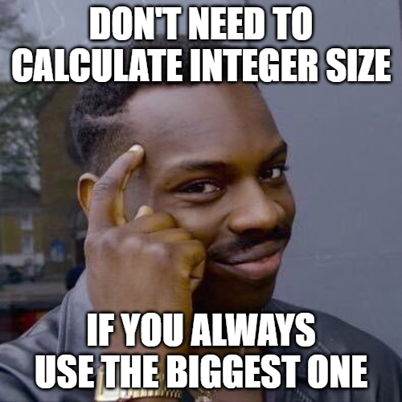

# GDScript to C++ Episode 2: Memory and Integrals

Programs write data to memory addresses.

```cpp
int x; // arbitrary memory address, e.g. 450130
```

How to reference?

Map symbol to location via "symbol table".

Symbol tables record variable locations for later reference.

In GDScript, this would be like a Dictionary of strings mapped to integers of array indices.

```gdscript
var symbols = {}
var values = PoolByteArray()

# int x = 2; // C++
symbols['x'] = 450130
values[450130] = 0
values[450131] = 0
values[450132] = 0
values[450133] = 2
```

But, *how* do we write data?

**Data Type** determines read/write algorithm.

## Data Type: Byte Size & Arrangement

*How many bytes ("byte size")?*

Get size with `sizeof(type)` operator.

```cpp
// `int` is 4 bytes.
sizeof(int) == 4; // true
```

Program views memory as sequentially ordered:

```cpp
int x; // 450130-450133
int y; // 450134-450137 (+ 4)
```

Ways to express integer value:

```cpp
// decimal
// Syntax: None
// Values: 0-9
// 1 byte: N/A
int x = 1;

// binary
// Syntax: `b` suffix
// Values: 0-1
// 1 byte: 8 digits
int x = 10110110111100001111111101010101b;

// octal
// Syntax: `0` prefix
// Values: 0-7
// 1 byte: 4 digits
int x = 00123456701234567;

// hexadecimal
// Syntax: `0x` prefix
// Values: 0-9, A-F (0-15)
// 1 byte: 2 digits
int x = 0x02468ACE;
```

*How are the bits arranged?*

```cpp
// `int` bit arrangement? "Two's Complement"
// 1. Leading bit == sign.
// 2. Remaining bits == value.
int sx = 0;  // 0x00000000
int sy = 1;  // 0x00000001
int sz = -1; // 0xFFFFFFFF

// Negated value == flip bits + 1

// pos -> neg
// -0x00000001 + 1
//  0xFFFFFFFE + 1
//  0xFFFFFFFF

// neg -> pos
// -0xFFFFFFFF + 1
//  0x00000000 + 1
//  0x00000001
```

## Data Types: Interpreting Bits

Data type controls data *interpretation*.

"casting" == converting type A to type B.

In GDScript:

```gdscript
var x = "1"
x = int(x) # cast value to int
x = str(x) # cast value back to string
x = str(int("1")) # nested casts
```

In C++, same, but the data type controls interpretation of *bits*.

```cpp
unsigned int ux = 0;  // 0x00000000
unsigned int uy = 1;  // 0x00000001
unsigned int uz = -1; // 0xFFFFFFFF, becomes 4294967295
```

> Note: `int` is `signed int` by default. Literals default to `int`.

```cpp
// unsigned int <- signed int
unsigned int uz = -1;
```

Static Cast: *compile-time* conversion. The code *won't compile* if incompatible.

Implicit static cast:

```cpp
// unsigned int <- signed int
unsigned int uz = -1;
```

Explicit static cast:

```cpp
// unsigned int <- (unsigned int <- signed int)
unsigned int uz = (unsigned int) -1;
```

Notice:

- GDScript: Calls global function and passes expression as parameter.
- C++: Wrap the *type* in parentheses. Order of operations applies type to expression.

Wrap in parentheses to nest casts.

```cpp
int nested = (int) ((unsigned int) -1);
int nested = (int) 4294967295;
int nested = -1;
```

Other ways to manipulate data type?

## Data Types: Byte Size Variation

Changing byte size...

```cpp
char c; // 1-byte signed integer (>= 8 bits)
short s; // 2-byte signed integer (>= 16 bits)
int x; // 4-byte signed integer (~32 bits, >= 16 bits)
long x2; // 4-byte signed integer (>= 32 bits)
long long y; // 8-byte signed integer (>= 64 bits)
```

Exact size depends on compiler implementation.

> [See more about int sizes per platform](https://stackoverflow.com/a/589685).
> 
> [See more about all types' size variance](https://en.cppreference.com/w/cpp/language/types).

Using sizes in code: always use `sizeof(type)`, never a literal.

GDScript == only 64-bit signed integers. Why?



So, how does byte size affect casting?

```cpp
// size: small -> big
char c = 1; // 0x01
int x = c;  // 0x00000001, zero-filled

// size: big -> small
int x = 256; // 0x00000100
char c = x;   // 0x00, truncated: 0x000001|00
```

How does the byte size reality affect data? Underflow and overflow:

```cpp
// Underflow
unsigned int x = 0; // 0x00000000
x = x - 1; // 0xFFFFFFFF

// Overflow
int y = INT_MAX; // ~ 32k or ~ 2b
y = y + 1;       // ~ -32k or ~ -2b
```

## Typedef

In GDScript, you can load a "class" into a given name.

You can then also rename that class by defining another constant with the same value.

```gdscript
const MyClass = preload("my_class.gd")
const SameClass = MyClass
```

In C++, you can similarly define an alias for a typename using the `typedef` keyword.

```cpp
// Syntax: typedef <OldName> <AliasName>
class A {};
typedef A AA;

A a;
AA aa; // same type as `a`
```

Typedefs are used to define concrete sizes for integral values on various platforms.

```cpp
int8_t  // signed
int16_t
int32_t
int64_t
uint8_t // unsigned
uint16_t
uint32_t
uint64_t

size_t  // unsigned int on native platform
```

## Enum

Enums are finite lists of numeric values.

In GDScript, an `enum` defines a Dictionary constant with `string:int` keys.

```gdscript
enum Suit {
    Spades,  # int: 0
    Clubs,   # int: 1
    Hearts,  # int: 2
    Diamonds # int: 3
}

const SPADES: int = Suit.Spades # works!
var keys: Array = Suit.keys()
var spades_key: string = keys[0] # works!
var size = Suit.size()
```

In C++, `enum` = type declaration for 1+ integral values.

```cpp
enum Suit {
    Spades,   // 0
    Clubs,    // 1
    Hearts,   // 2
    Diamonds, // 3
    SUIT_SIZE // 4, last record used for size
}; // note: quotes and semi-colon

Suit s = Spades; // same as `s = 0;`
s = 1000; // C++ doesn't block other integral values!

int size = Suit.size(); // Error! No member `size()`
int size = SUIT_SIZE; // 4
```